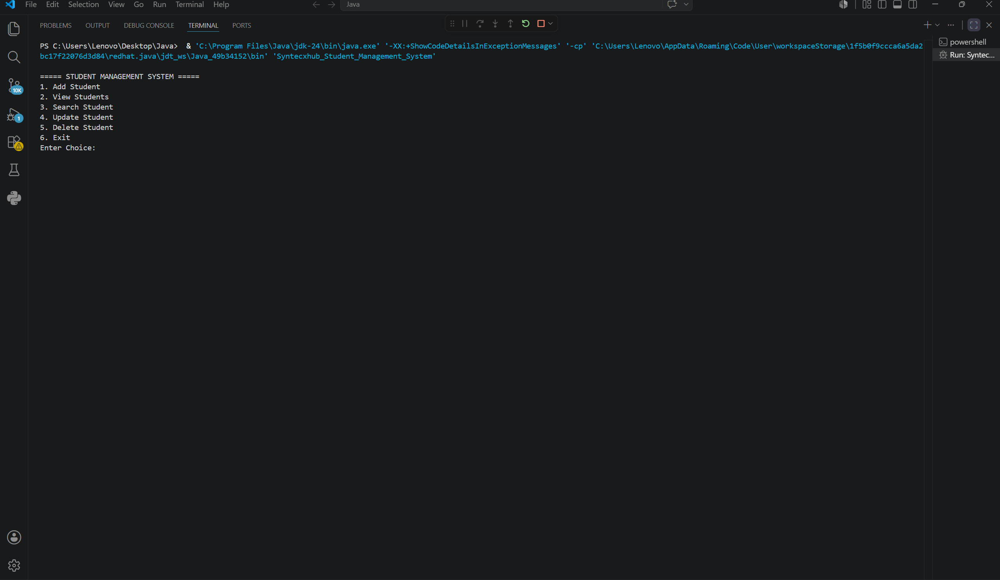
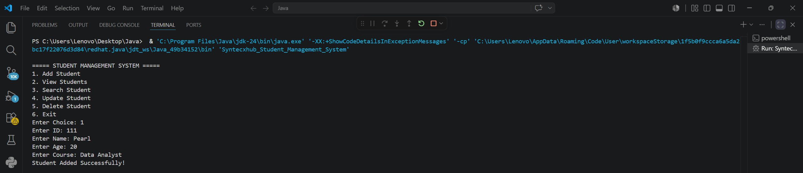
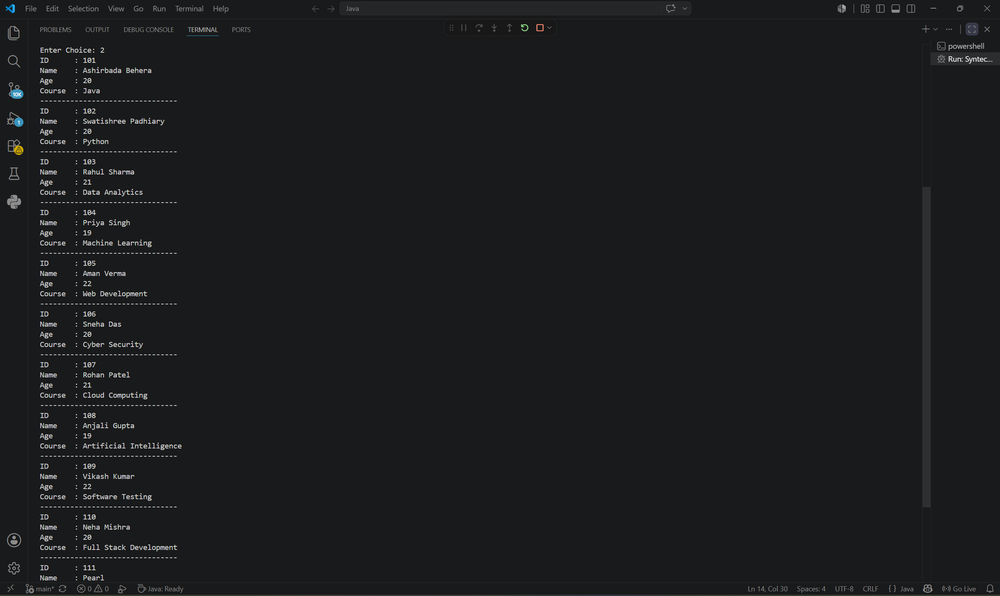
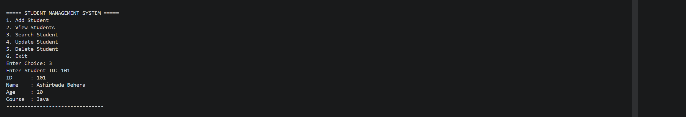
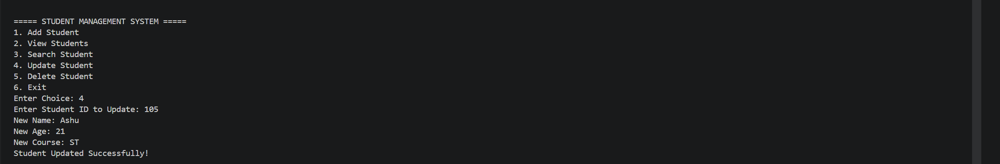

# 🎓 Student Management System in Java

A simple and efficient Student Management System developed using Java. This console-based application allows users to manage student records by performing operations such as adding, viewing, searching, updating, and deleting student information.

---

## ⭐ Features

✨ Add New Student Records

✨ View All Students

✨ Search Student by ID

✨ Update Student Details

✨ Delete Student Records

✨ Easy-to-Use Console Application

---

## 🛠️ Technologies Used

* Java
* Object-Oriented Programming (OOP)
* ArrayList
* Scanner Class
* CRUD Operations

---

## 🎯 Functionalities

⭐ Add Student Details

⭐ View All Student Records

⭐ Search Student by ID

⭐ Update Existing Student Information

⭐ Delete Student Records

⭐ Exit the Application

---

## 📸 Screenshots

### Main Menu

### Add Student

### View Students

### Search Student

### Update Student

---

## 📚 Learning Outcomes

✔ Java Programming Fundamentals

✔ Object-Oriented Programming Concepts

✔ ArrayList Operations

✔ User Input Handling using Scanner

✔ CRUD Operations Implementation

✔ Menu-Driven Application Development

---

## 👨‍💻 Author

Swatishree Padhiary

---

## License

This project is created for educational and learning purposes.
